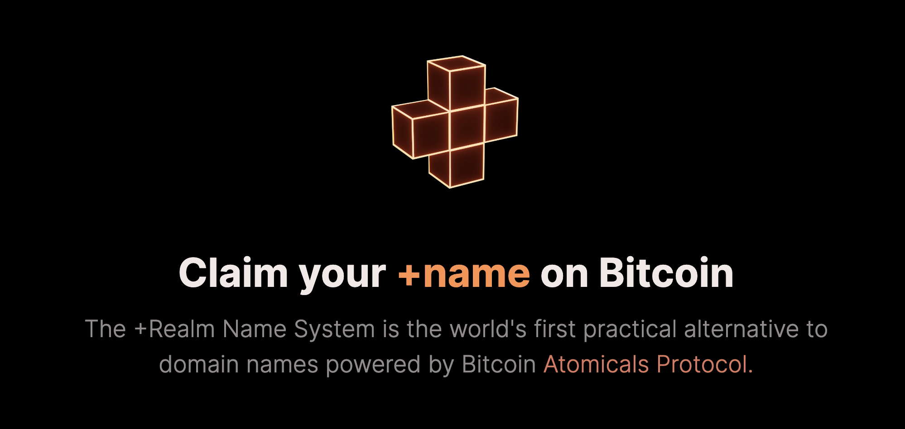

# Realm.Name Sample Web App
> Realms is a part of the <a href="https://atomicals.xyz">Atomicals Protocol</a>
>
> Documentation: https://docs.atomicals.xyz



<br />

---
 
## Install & Start

Update `.env` or `.env.local` or `.env.production` to use your <a href="https://github.com/atomicals/electrumx-proxy">electrumx-proxy</a> server.

⚠️ Using [Yarn Package Manager](https://yarnpkg.com) is recommended over `npm`.

```
yarn install
yarn build
yarn build prod
yarn start
```

with npm:

```
npm install
npm run build
npm run build prod
npm run start
```

## License

This project is licensed under the MIT license, Copyright (c) 2019 Maximilian Stoiber.
For more information see `LICENSE.md`.
